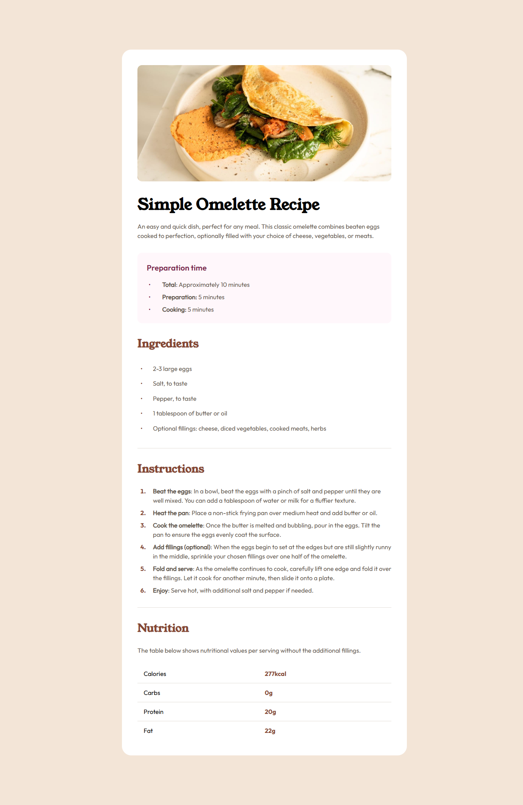

# Frontend Mentor - Recipe page solution

This is a solution to the [Recipe page challenge on Frontend Mentor](https://www.frontendmentor.io/challenges/recipe-page-KiTsR8QQKm). Frontend Mentor challenges help you improve your coding skills by building realistic projects.

## Table of contents

- [Overview](#overview)
  - [The challenge](#the-challenge)
  - [Screenshot](#screenshot)
  - [Links](#links)
- [My process](#my-process)
  - [Built with](#built-with)
  - [What I learned](#what-i-learned)
  - [Continued development](#continued-development)
  - [Useful resources](#useful-resources)
- [Author](#author)
- [Acknowledgments](#acknowledgments)

**Note: Delete this note and update the table of contents based on what sections you keep.**

## Overview

This is a solution to the [Recipe page challenge on Frontend Mentor](https://www.frontendmentor.io/challenges/recipe-page-KiTsR8QQKm). The challenge is to build a responsive recipe page featuring a recipe card layout. The page should display the recipe's image, details, ingredients, preparation time, cooking instructions, and nutritional information. This solution has been designed with a mobile-first approach and incorporates modern web design practices.

---

## The Challenge

The main objective of this challenge is to build a recipe page that features a clean, responsive layout with the following specifications:

- Display a recipe card with an image, title, description, ingredients, preparation time, cooking instructions, and nutrition facts.
- Ensure that the design is mobile-first and fully responsive, making the page accessible across a wide range of screen sizes (320px to large desktop screens).
- Implement semantic HTML5, clean CSS, and design according to the provided style guide.
- Ensure the recipe card is presented with clear typography and usable spacing for a user-friendly experience.
- The page should work seamlessly on both mobile and desktop devices.

## Screenshot

## Links

- Solution URL: (https://github.com/FrontEndExplorer-Temp/recipe-page)
- Live Site URL: (https://frontendexplorer-temp.github.io/recipe-page/)

## My process

## My Process

In this project, I focused on creating a clean and responsive layout using semantic HTML5 and modern CSS techniques. I followed a mobile-first approach to ensure that the design would work well on smaller devices, progressively enhancing the layout for larger screens. The project was built using Flexbox and custom CSS properties for styling. I made sure to adhere to the provided style guide and kept accessibility in mind throughout the process.

---

### Built with

- Semantic HTML5 markup
- CSS custom properties
- Flexbox
- Mobile-first workflow

## What I learned

Throughout this project, I deepened my understanding of responsive web design and semantic HTML. I gained experience with using custom properties (CSS variables) for more flexible and maintainable styling, as well as utilizing Flexbox for layout management.

One key learning moment was optimizing the layout for both mobile and desktop views using a mobile-first approach. This approach allowed me to think about how elements should behave on small screens first and then progressively enhance them for larger screens.

Additionally, I refined my ability to style elements according to a provided style guide, which is an important skill for real-world projects where consistency and adherence to design guidelines are crucial.

Here are some areas I focused on:

- **Responsive design**: Ensuring the page is functional across various screen sizes.
- **Semantic HTML**: Making the structure of the page clear and accessible.
- **CSS Variables**: Using custom properties for cleaner and more maintainable styles.

## Continued development

In future projects, I plan to focus more on improving my JavaScript skills, particularly in areas like interactivity and DOM manipulation. I would like to explore how to integrate more advanced JavaScript features like event handling and animations.

Additionally, I want to experiment more with CSS Grid to better understand its full potential for building complex layouts. I also plan to refine my understanding of CSS methodologies like BEM (Block, Element, Modifier) to help structure my stylesheets in a more organized and scalable way.

Finally, I aim to enhance my knowledge of accessibility (WCAG) standards to ensure my projects are inclusive and usable by people with different needs.

### Useful resources

- [Frontend Mentor Challenge](https://www.frontendmentor.io/challenges/recipe-page-KiTsR8QQKm) - This challenge was a great starting point for improving my HTML and CSS skills. The detailed design files and guidance really helped me understand how to structure a page and style it effectively.
- [CSS Tricks - Flexbox](https://css-tricks.com/snippets/css/a-guide-to-flexbox/) - This guide helped me learn and practice Flexbox, which was crucial for creating a responsive layout in this project. It’s a resource I’ll keep referring to for future projects.
- [MDN Web Docs](https://developer.mozilla.org/en-US/docs/Web/CSS/CSS_Grid_Layout) - MDN’s CSS Grid documentation provided a solid foundation for understanding CSS Grid. Though I didn't use it extensively in this project, I plan to use it more in the future for complex layouts.
- [WebAIM - WCAG 2.1 Checklist](https://webaim.org/standards/wcag/checklist) - This checklist was a helpful resource for ensuring that my project adhered to accessibility standards. I’ll continue using it as a reference for future projects.

## Author

- GitHub - [FrontEndExplorer-Temp](https://github.com/FrontEndExplorer-Temp)
- Frontend Mentor - [FrontEndExplorer-Temp](https://www.frontendmentor.io/profile/FrontEndExplorer-Temp)

## Acknowledgments

- I would like to thank the Frontend Mentor community for their continuous support and for providing challenges that push me to improve my skills.
- A special thanks to all the developers who share their solutions and insights on the platform, making it easier for beginners like me to learn and grow.
- I would also like to acknowledge the resources, tutorials, and documentation available online, which were instrumental in helping me understand the tools and concepts I used for this project.
